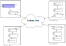

# Low Level API

## General Concept



```python
from yapapi.rest import Configuration, Market, Activity, Payment
from yapapi import props as yp
from yapapi.props.builder import DemandBuilder
from datetime import datetime, timezone


async def list_offers(conf: Configuration):
    async with conf.market() as client:
        market_api = Market(client)
        dbuild = DemandBuilder()
        dbuild.add(yp.NodeInfo(name="some scanning node"))
        dbuild.add(yp.Activity(expiration=datetime.now(timezone.utc)))

        async with market_api.subscribe(
            dbuild.properties, dbuild.constraints
        ) as subscription:
            async for event in subscription.events():
                print("event=", event)
        print("done")
```

## Access Configuration

### Class `yapapi.rest.Configuration(...)`

**Initialization Arguments**

`app_key`: (optional) str : Defines access token to API Gateway
